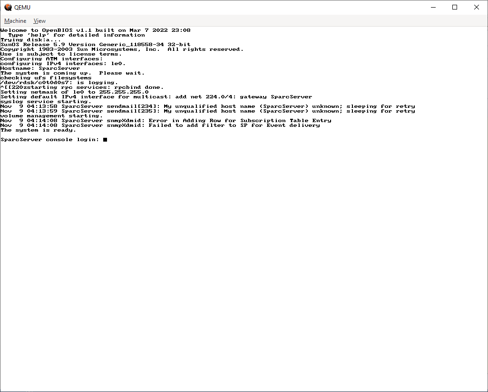

# Revitalizing an EDA platform for SPARC native binary codes

By [M. B. Ghaznavi-Ghoushchi](https://github.com/ghoushchi).

This is a try to revitalize an EDA platform for SPARC binary codes. This is done via a dynamic link emulation execution via [QMEU](https://www.qemu.org/) instead of conventional virtualizations alike vmware and virtualbox. This helps you directly run ALL SunOS and SPARC binary files directly spanning support up to SunOS 5.9.

# Introduction
While we are facing with very fine tools and OS support for modern EDA Tools, it is strange to think about revitalizing an EDA platform for SPARC native binary codes which in some sense it belongs to the history rather than the front-line of progress at first glance. But it may be interested if the EDA folks look into a facts list:

* There were many great EDA tools for SPARC machines now are out of access to run. But they are source of inspiration for new generations of EDA programmers. Having a ready-to-run platform for such tools not only acts as a golden model running beside of current tools, but also their available source will be used with bundled ready-to-test binary files.
* There are still some sort of EDA Tools for example some set of Memory compilers are solely ported for SPARC stations and they are still in demand for example in node technologies like 180nm and 130nm.

Among the tools for SPARC here some of them are mentioned:
* [Power Optimization and Synthesis Environment](https://mpedram.com/~pose/) 
* [Sycraft (SYmboliC synthesizeR and Adder of Fault-Tolerance)](http://www.cse.msu.edu/~sandeep/sycraft/)
* [IC CAD Micro Magic](https://sourceforge.net/projects/mmi-pd/support)
* A lots!: A simple search [click here to see](https://www.google.com/search?q=(site%3Aedu+OR+inurl%3A.edu+OR+inurl%3A.ac)+(CAD+OR+vlsi+OR+CMOS)+(solaris+OR+sparc+OR+sunos)+(.tar.Z+OR+.gz+OR+.tar+OR+tar.gz)) in Google with terms ```  (site:edu OR inurl:.edu OR inurl:.ac) (CAD OR vlsi OR CMOS) (solaris OR sparc OR sunos) (.tar.Z OR .gz OR .tar OR tar.gz)  ``` unveils a huge collection of academic tools and programs in this area still ready to access, download and use in anyway.

## 1. Download required tools
1. QEMU for target host machine from [QEMU download section](https://www.qemu.org/download/). This is the main emulation program for our task. Installation has no problem at all.
2. Miniweb from [here](https://github.com/avih/miniweb) or [here](https://sourceforge.net/projects/miniweb/). This is very important for file transfer between host/guest environments. 
3. Main DVD of Solaris 9 solaris-2.9-sparc.iso from [here](http://www.w6rz.net/solaris-2.9-sparc.iso).


## 2. Steps for settings up and installations 
### 2.1 Pre-installation step

1. Install QEMU normally.
2.  Then create a folder with available size of about 10-40GB storage free for example ```QEMU.SunOS-5.9```. 
3. Create a subfolder for example ```QEMU.shared``` inside of above folder. So, you will have  ```QEMU.SunOS-5.9/QEMU.shared```.
3. To install ```miniweb```, simply copy the file ```miniweb(.exe)``` and the folder ```htdocs``` to ```QEMU.SunOS-5.9/QEMU.shared``` folder. From now by running this light web server, you have access to the contents of ```htdocs``` for upload or download via the guest machine. 


### 2.2 Creating the guest image file
Create the SPARC image file with size allocation:
```bash
qemu-img create -f qcow2 sparc.qcow2 36G
```
Prepare the actual disk for SPARC. This will take a while and during it you must provide required information for exampleL language, time setting, user login information, etc. Please be paitent and do with care:

```bash
qemu-system-sparc -L . -M SS-20 -m 256  -drive file=sparc.qcow2,bus=0,unit=0,media=disk -drive file=solaris-2.9-sparc.iso,bus=0,unit=2,media=cdrom,readonly=on
```
In the above command and process we have two important file names: ``` solaris-2.9-sparc.iso``` which is the DVD of Operating system and ```sparc.qcow2``` which is the target image file. After successful completion of above command **DO NOT TRY IT AGAIN**, since it will overwrite the main file ```sparc.qcow2``` and all the done process with be wiped-out.

Now we have a working SunOS 5.9 (Solaris 2.9) with native binary code running capability.

To run and invoke the system run this command.
```bash
qemu-system-sparc -M SS-20 -m 256 -drive file=sparc.qcow2,bus=0,unit=0,media=disk
```




## 3. Transfer files between host (your main machine) and guest (SPARC)
First start ``` miniweb ```

Then you will see a window like this:

As it is seen the miniweb starts with a specified IP address for example ``` 192.168.1.117``` and port 8000. Please forget it!. From inside of the SPARC machine you will look for address ```10.0.2.2:8000 ``` in the Netscape browser and now you have accessed the host machine from inside of guest SPARC.


### 3.1 How to send files to SPARC machine:
Simply copy to ```htdocs``` anything you want to transfer to SPARC machine and then start browser and open ```http://10.0.2.2:8000/``` and download the program INSIDE of SPARC.


### 3.2 How to send files from SPARC machine to host machine:
Simply open ```http://10.0.2.2:8000/``` inside the SPARC machine and click on ```upload.html``` link and upload the anything you want to.


## 4. Sample run screenshots


### Credits:
All the credits are belong to their originators.

# Related Projects
Please follow us to be informed about related projects:


<p>
<a href="https://github.com/yarpose" rel="nofollow noreferrer">
     YARPOSE - A Dejavu project in EDA
  </a><br>
  <a href="https://www.linkedin.com/in/ghaznavi-ghoushchi" rel="nofollow noreferrer">
     M. B. Ghaznavi-Ghoushchi
  </a> &nbsp; 
  <a href="https://github.com/ghoushchi" rel="nofollow noreferrer">
     ghoushchi
  </a>
</p>


